# Welcome to Ecoystem Collaboration

This project uses IBM Watson Discovery to build a platform for promoting collaboration. It allows companies to sign up to the platform and project managers to search for companies to collaborate with. This is proof of concept project that runs locally using [Docker](https://www.docker.com). Dummy data is uploaded to the Discovery Collection when the project is first run.

## Running the project

An [IBM Cloud](https://cloud.ibm.com/registration) account is required to run this webapp. After creating an account, follow these instructions in order to create a Watson Collection. Information about the collection needs to be entered in the template.env file located in "./backend" so the webapp can access the Collection. The following instructions describe how to do this:

1. Login to your account and click on "Create resource".

2. Type "Watson Discovery" into the search field and click on Watson Discovery. This will redirect you to a page where you can create a new free "lite" Watson Discovery Instance.

3. Fill out the fields to create the Watson Discovery Instance and then open the sidebar and click on "Resource List".

4. Click on the new the new instance that you have created under the "Services" tab. It may take a few minutes for the new instance to be deployed fully.

5. Copy the API Key and paste it to replace "<api_key>" in the template.env file and then copy the URL and paste it to replace "<service_url>" in the template.env file. Click "Launch Discovery".

6. Click on "Upload your own data" and enter a collection name (e.g. "Ecosystem Collaboration Tool") and then click "Create". (When you click on "Upload you own data", you may see a prompt regarding setting up Discovery for your own private data. Just click on "Set up with current plan" to continue).

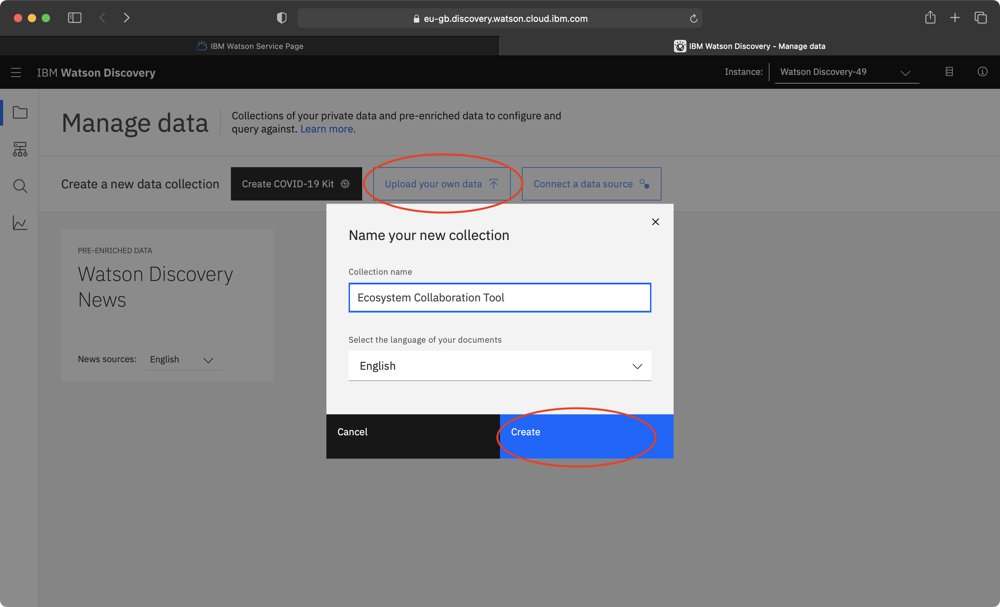

7. Once the collection has been made, click the API button near the top right and copy the "Collection ID" and "Environment ID" and paste it to replace the "<collection_id>" and "<environment_id>" respectively.

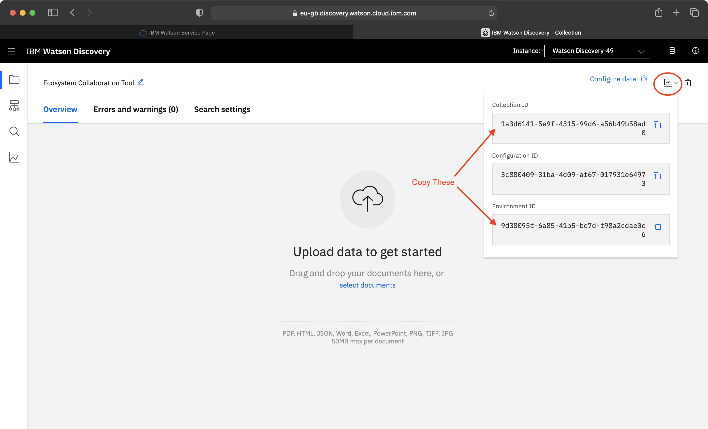

8. Rename the template.env file to ".env".

Now that Watson Discovery is setup, [Docker](https://www.docker.com) is required to run this project and will eliminate the need to install dependencies onto your machine. Once Docker is installed and running, ensure that ports 3000 and 9000 are not being used by other programs. Now simply open terminal in this directory and run the command `docker-compose up` to start the webapp. Navigate to `http://localhost:3000` on a browser and enjoy!

## Using the project

There are three use cases for this project which are outlined in the use case diagram below.

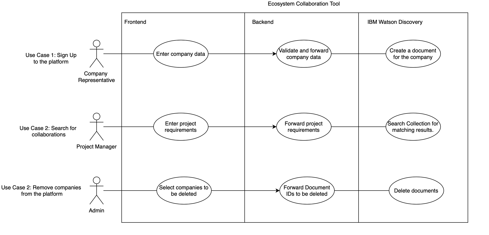

### Sign Up

For a user to sign up, they need to navigate to the sign up page by either clicking on the sign up button on the homepage or by navigating to `http://localhost:3000/signup`.
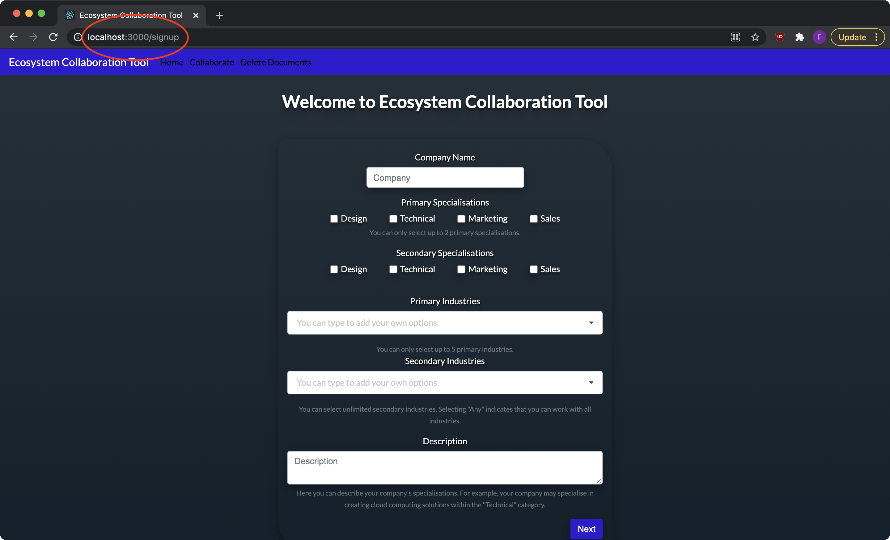
After filling out the required information in the sign-up form, the user can submit the form by clicking the 'Submit' button on the final page of the form.
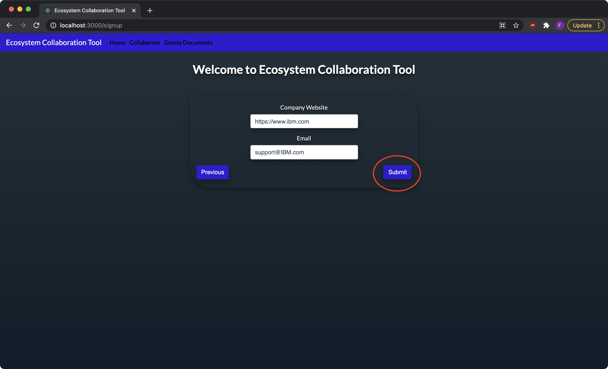
A success message will be displayed that indicates that the sign up has been successful.
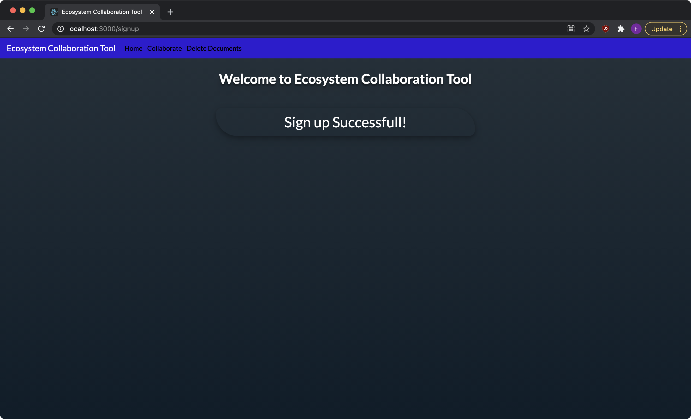

### Collaboration Search

In order for a user to search the platform, they need to navigate to the collaboration page by either clicking on the collaborate button on the homepage or navbar, or by navigating to `http://localhost:3000/collab`. This page allows users to enter their project requirements and submit the form to see the results.
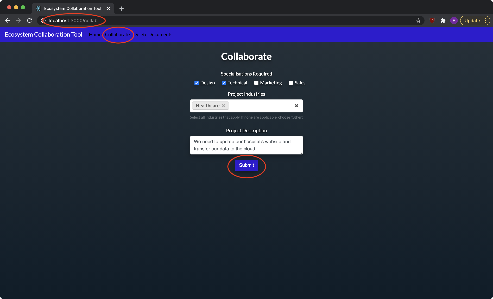
After the search has been executed, the results will be displayed on a graph as shown below.
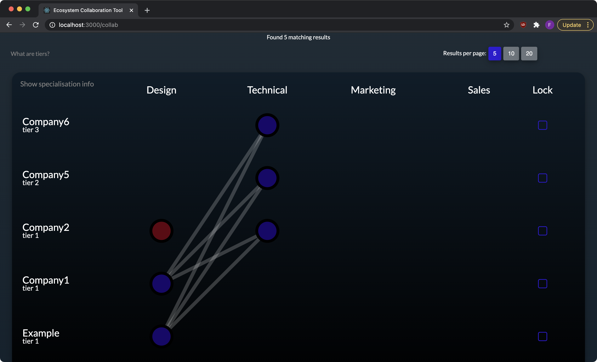
Here the user is able to change the number of results per page, lock results and view more information about companies by clicking on a company's name. Clicking on a company's name will add a tab at the bottom which allows the user to view the information about that company.
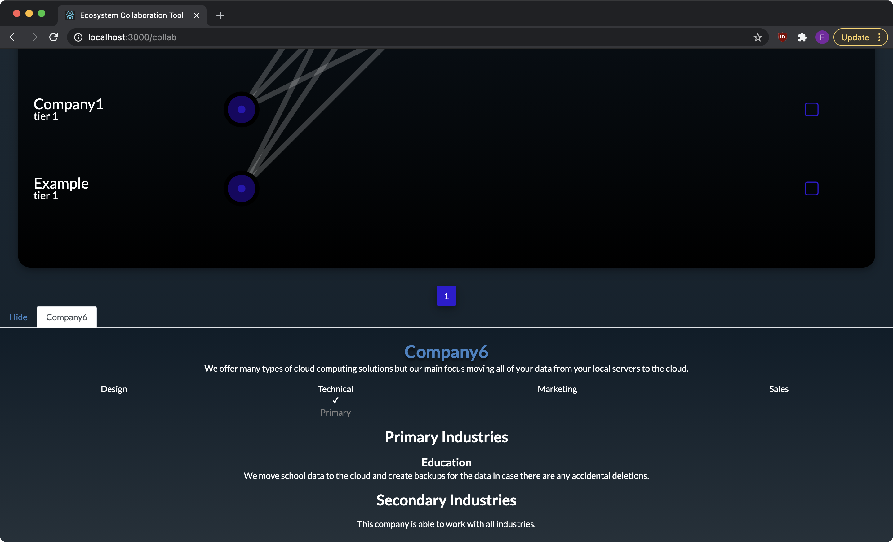
Locking a company ensures that a particular result stays on the graph even when the page is changed. It also adds a tab at the bottom which shows that company's information.

### Removing Companies

A company is removed from the platform by deleting that company's document from the Discovery Collection. This can be done from the Delete Documents page that can be navigated to from the navbar or by entering the URL `http://localhost:3000/withdraw`.
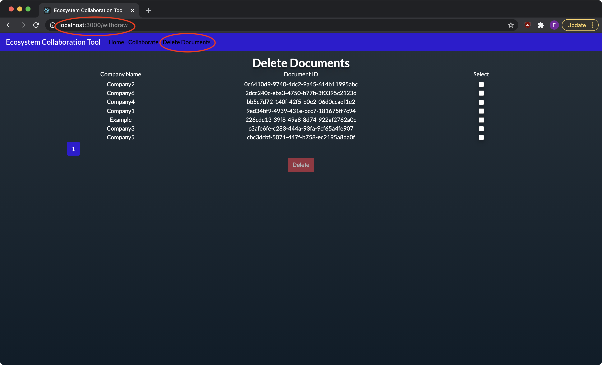
To delete companies, select the checkboxes associated to the companies that need to be deleted. Then click the Delete button.
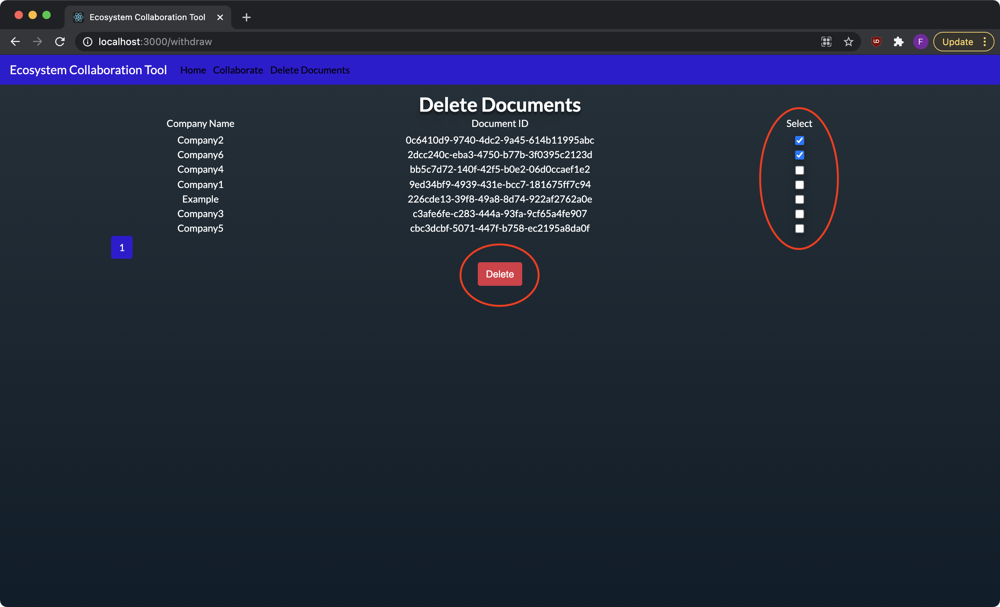
You will then be prompted to confirm that you would like to delete the selected documents. Click the delete button to delete the selected documents.
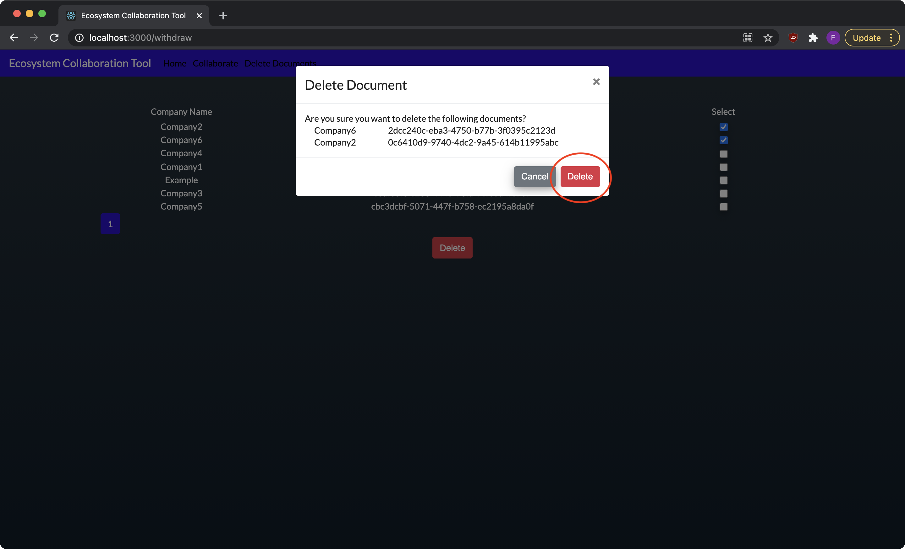
