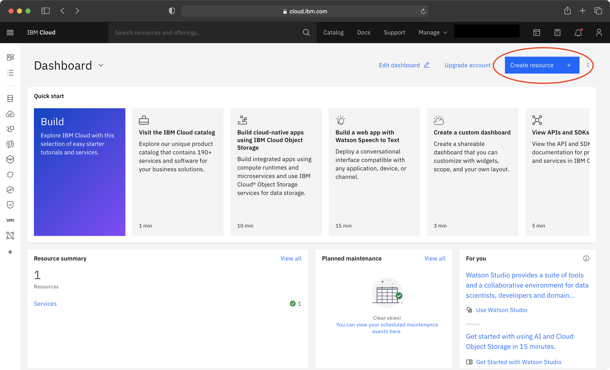
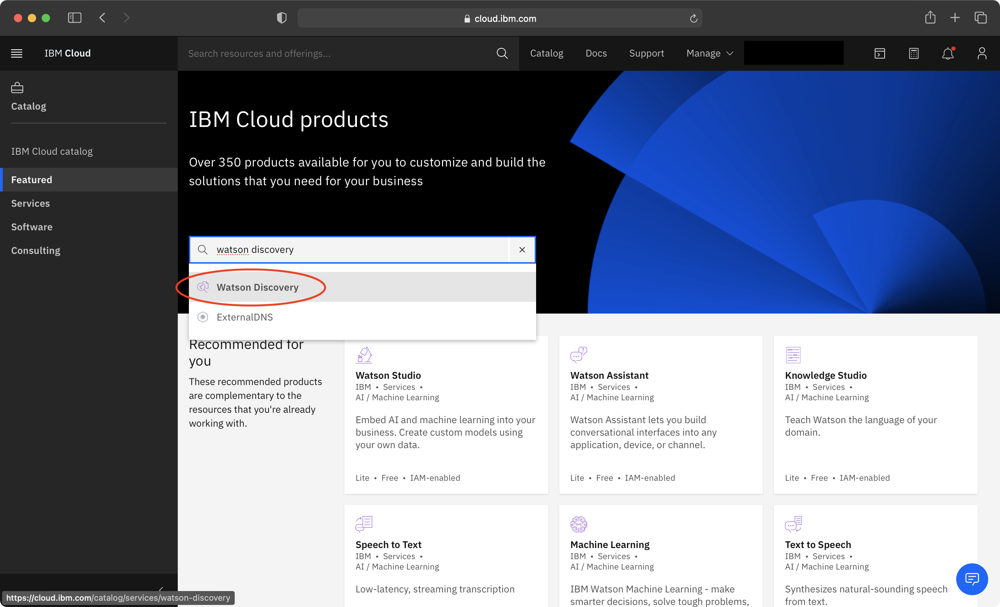
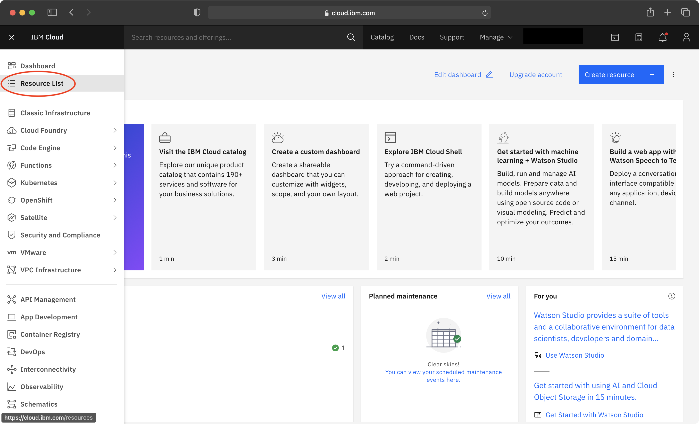
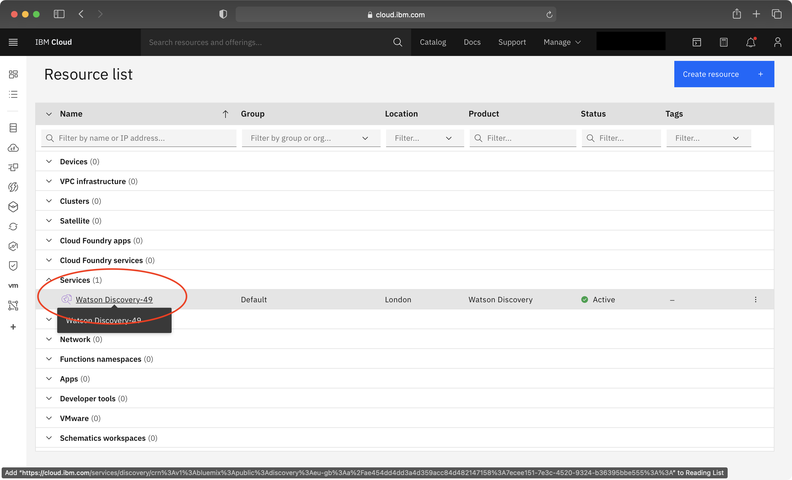
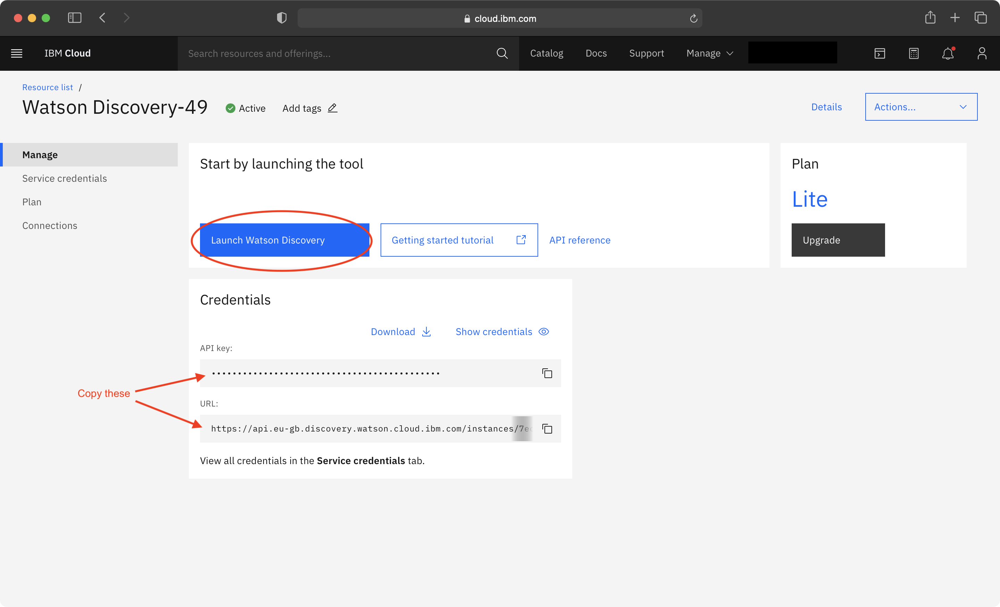

## Welcome to Ecoystem Collaboration Tool.

An IBM Cloud account is required to run this webapp. After creating an account follow these instructions in order to create your Watson Collection.

1. Login to your account and click on "Create resource".

2. Type "Watson Discovery" into the search field and click on Watson Discovery. This will redirect you to a page where you can create a new free Watson Discovery Instance.

3. Fill out the fields to create the Watson Discovery Instance and then open the sidebar and click on "Resource List".

4. Click on the new the new instance that you have created under the "Services" tab.

5. Copy the API Key and URL as these will be required later. Click "Launch Discovery".

Docker is required to run this project and will eliminate the need to install other dependencies onto your machine. Once Docker is installed and running, ensure that ports 3000 and 9000 are not being used by other programs. Now simply open terminal in this directory and run "docker-compose up" to start the webapp. Navigate to localhost:3000 on a browser and enjoy!
